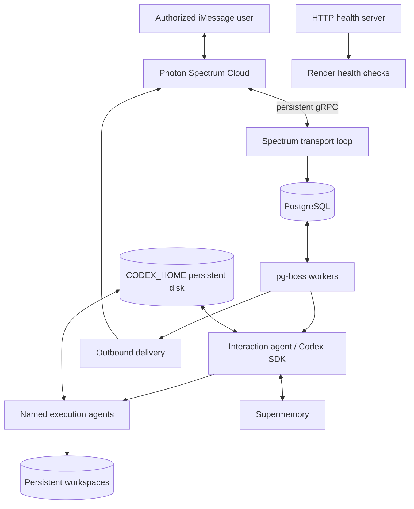
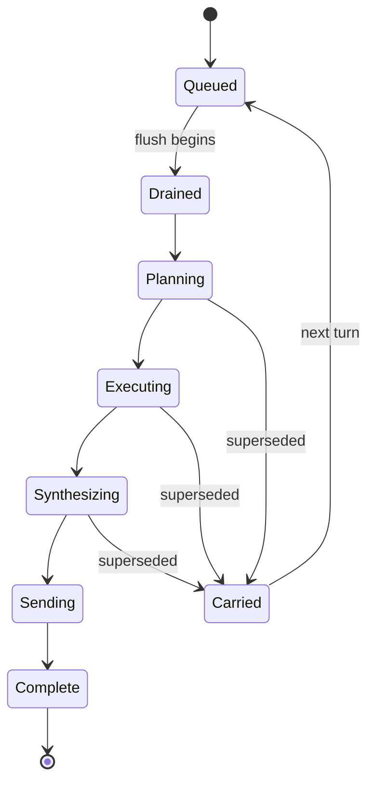

# Architecture

## 1. System overview

The application is one long-running Node.js service with three concurrent responsibilities:

1. A persistent Spectrum Cloud gRPC consumer reads iMessage events.
2. pg-boss workers execute the durable inbound, agent, outbound, and memory pipeline.
3. A small HTTP server exposes liveness and readiness endpoints to Render.

PostgreSQL is the operational source of truth. Supermemory is an external semantic-memory projection. Codex CLI state and workspaces live on a persistent disk under `CODEX_HOME` and `AGENT_WORKSPACE_ROOT`.



## 2. Why gRPC instead of the starter’s webhook

The original starter uses an HTTP webhook because it is the smallest Render-compatible hello-world path. The requested boilerplate explicitly needs Spectrum’s cloud gRPC protocol and a continuously running agent. The new implementation therefore consumes:

```ts
for await (const [space, message] of spectrum.messages) {
  // authorize, persist, and enqueue; do not run Codex inline
}
```

The receive loop does almost no work. It validates direction/type, resolves sender identity, writes the inbound event, and schedules or resets the space’s debounce job. This protects the gRPC stream from model latency and makes every accepted message recoverable.

## 3. Process topology

```text
src/index.ts
  ├─ validate configuration and disk permissions
  ├─ connect PostgreSQL and run compatibility checks
  ├─ start pg-boss and register workers
  ├─ start HTTP liveness/readiness server
  ├─ initialize Spectrum and begin app.messages loop
  └─ install graceful shutdown handlers
```

A single process is the deliberate v1 default. It keeps the Blueprint close to the original starter. The design still uses durable jobs and module boundaries so the workers can be split later without rewriting contracts.

## 4. Inbound pipeline

### Stage 1: receive and persist

For each Spectrum event:

1. Reject outbound echoes.
2. Accept only supported inbound text events in v1.
3. Narrow to iMessage and normalize sender address.
4. Authorize sender and group context in code.
5. Insert the message using a unique external message identifier.
6. Upsert space GUID, route phone, and participants.
7. Enqueue/reset `inbound.flush` for `now + debounceMs`.

The job payload contains only identifiers. The message rows stay in PostgreSQL until the handler drains them.

### Stage 2: flush

`inbound.flush`:

1. Acquires a per-space advisory lock or transactional ownership row.
2. Loads undrained inbound messages and any carried messages.
3. Creates a new `chain` with a monotonic `chain_started_at`.
4. Marks messages drained into the chain.
5. Cancels prior interruptible chain jobs.
6. Enqueues `turn.plan`.

### Stage 3: plan

`turn.plan`:

1. Checks the chain has not been superseded.
2. Loads recent thread history from PostgreSQL.
3. Loads owner profile and bounded relevant memories from Supermemory.
4. Loads active named-agent summaries and capabilities.
5. Resolves model profile.
6. Runs the interaction Codex thread with a structured output schema.
7. Persists `InteractionDecision`.
8. Sends a status bubble when delegation will be perceptibly long.
9. Either enqueues outbound delivery or creates execution jobs.

### Stage 4: execute

Each `task.execute` job:

1. Verifies chain/task state and authorization.
2. Resolves or creates the named execution agent and workspace.
3. Builds an explicit Codex environment allowlist.
4. Applies model, sandbox, network, approval, and working-directory options.
5. Runs the Codex thread.
6. Validates `ExecutionResult`.
7. Persists artifacts and proposed actions.
8. Marks the task terminal.

When all required tasks are terminal, one `turn.synthesize` job is enqueued using a unique chain key.

### Stage 5: synthesize

`turn.synthesize`:

1. Loads successful and failed task results.
2. If a consequential action is proposed, creates an approval request rather than executing it.
3. Runs the interaction thread to produce the final user-facing response.
4. Creates an outbound batch and memory-curation job.

### Stage 6: send

`outbound.send`:

1. Rehydrates the Spectrum space from stored GUID and route phone.
2. Reads `start_index` from the outbound batch.
3. Sends each remaining bubble with its stable client GUID.
4. Advances the cursor only after confirmed success.
5. Retries transient failures with the same IDs.
6. Marks the chain complete.

### Stage 7: memory projection

`memory.curate`:

1. Runs only after the chain has a successful terminal response.
2. Extracts durable candidates through a separate schema-bound prompt.
3. Applies deterministic privacy and durability filters.
4. Adds or updates Supermemory records.
5. Stores external IDs and hashes in `memory_sync_events`.

## 5. Burst handling and supersession

People text in fragments. The debounce window is per space, not global. A new message before flush simply moves the scheduled job forward. A new message after drain supersedes the active chain:



Cancellation is chain-aware. A stale `canceled_at` value must not cancel a later chain; handlers compare it with their own `chain_started_at` and state version.

## 6. Interaction and execution lanes

### Interaction lane

The interaction agent owns:

- Natural user-facing messages.
- Direct answers.
- Status acknowledgements.
- Task decomposition.
- Confirmation wording.
- Final synthesis.

It does not get unrestricted repository or shell access. Its default Codex thread is read-only with network disabled.

### Execution lane

Execution agents own bounded tasks. They receive:

- A single purpose.
- An isolated workspace.
- Explicit allowed paths.
- An explicit sandbox and network profile.
- A maximum runtime and output schema.
- Relevant task context, not the full private transcript.

They do not talk directly to the user and cannot authorize their own proposed actions.

### Named agents

A named execution agent is a durable context handle, such as:

- `photon-sdk-maintainer`
- `website-researcher`
- `release-manager`
- `travel-planner`

The mapping is stored in PostgreSQL, while Codex session files remain under `CODEX_HOME`. On startup, a thread ID is resumed. If resume fails, the system creates a new thread using a compact persisted summary and records the recovery event.

## 7. Codex runtime boundaries

The TypeScript SDK wraps and spawns Codex CLI. The runtime adapter must:

- Pin both `@openai/codex-sdk` and `@openai/codex` versions.
- Set `CODEX_HOME` explicitly.
- Pass a minimal environment to child processes.
- Select the working directory explicitly.
- Set `skipGitRepoCheck` only for intentionally non-repository workspaces.
- Use `runStreamed()` when progress signals are needed, while filtering raw events before user display.
- Persist thread IDs and terminal summaries.
- Abort tasks through an `AbortController` and process termination when a chain is superseded.
- Cap iterations, runtime, concurrent tasks, and output size.

## 8. Memory boundaries

```text
PostgreSQL                         Supermemory
-------------------------------    ---------------------------------
Raw inbound/outbound messages      Durable user facts
Space and sender routing           Preferences and relationships
Job and chain state                Long-lived project summaries
Approvals and audit events         Semantically searchable memories
Codex thread identifiers           User profile projection
Deletion receipts                  External memory item content
```

Supermemory is optional at turn time. PostgreSQL is not optional. No operational decision—authorization, routing, approval, retry, or delivery—may depend solely on semantic retrieval.

## 9. Authorization architecture

Authorization happens before prompt construction:

```text
Inbound sender
  → normalized identity
  → deployment owner / allowlist lookup
  → space policy lookup
  → group mention/reply gate
  → command or normal turn
  → only then model/queue work
```

The prompt may help interpret intent, but cannot upgrade identity or permissions.

## 10. Approval architecture

A consequential operation is represented as immutable data:

```ts
interface ApprovalRequest {
  id: string;
  ownerId: string;
  spaceId: string;
  requestedByTaskId: string;
  actionType: string;
  normalizedPayload: unknown;
  actionHash: string;
  humanSummary: string;
  expiresAt: string;
  status: "pending" | "approved" | "rejected" | "expired" | "consumed";
}
```

Approval responses are parsed in code, bound to the same owner and allowed space, and consumed exactly once. An execution task must re-hash the operation immediately before performing it.

## 11. Outbound idempotency

Every generated bubble is materialized before sending:

```ts
clientGuid = sha256(`${deploymentId}:${outboundBatchId}:${index}`)
```

The database stores `start_index`. A worker crash after transport acknowledgement but before cursor persistence may retry the same bubble, but the stable client GUID gives the transport a second deduplication layer.

## 12. Readiness model

`/healthz` returns success when the Node event loop is alive.

`/readyz` returns a redacted component map:

```json
{
  "ready": false,
  "components": {
    "database": "ok",
    "migrations": "ok",
    "queue": "ok",
    "spectrum": "connecting",
    "codexAuth": "missing",
    "codexCapabilities": "unknown",
    "disk": "ok",
    "supermemory": "configured"
  }
}
```

No secrets, phone numbers, paths outside approved roots, or raw exception payloads appear in this endpoint.

## 13. Graceful shutdown

On `SIGTERM`:

1. Set readiness false.
2. Stop accepting new queue work.
3. Stop or pause the Spectrum receive loop.
4. Mark active interruptible Codex tasks for retry and abort them.
5. Allow outbound sends to checkpoint within Render’s shutdown window.
6. Stop pg-boss.
7. Close database and HTTP listeners.
8. Exit nonzero if critical cleanup fails.

## 14. Scaling path

V1 cannot horizontally scale the Codex process while it depends on one attached persistent disk. When scale becomes necessary:

- Move Codex credentials to a supported enterprise credential service or per-worker secret mount.
- Put workspaces in durable object/block storage or provision per-worker volumes.
- Split receive, agent, and outbound workers.
- Keep PostgreSQL job and idempotency contracts unchanged.
- Partition by owner/deployment.

The starter should not pre-build this distributed topology.
